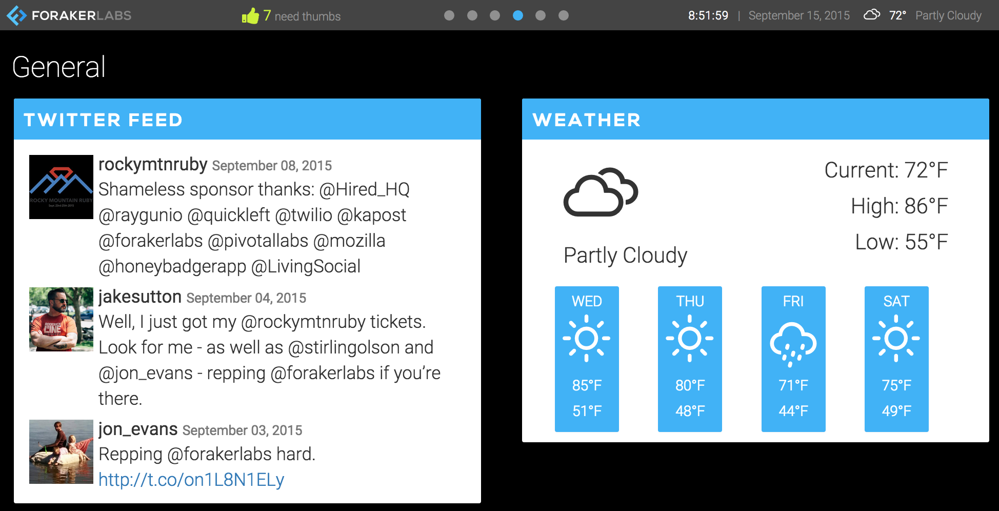

# Foraker StatusBoard

Providing up-to-the-date analytics, Tweets, pull requests, and more!



## Installation

`git clone git@github.com:foraker/statusboard.git`

Then create the database

`rake db:create db:migrate`

Set up your ENV variables with keys and tokens
[secrets.yml](config/secrets.yml)

Finally, import your data

```
rake import:twitter
rake import:github
rake import:analytics
rake active_pivot:import:pivotal_initial
```

(These commands may take a very long time)


## Contributing

Bug reports and pull requests are welcome on GitHub at https://github.com/foraker/statusboard.


## License

The gem is available as open source under the terms of the [MIT License](http://opensource.org/licenses/MIT).

## About Foraker Labs


This project is maintained by Foraker Labs. The names and logos of Foraker Labs are fully owned and copyright Foraker Design, LLC.

Foraker Labs is a Boulder-based Ruby on Rails and iOS development shop. Please reach out if we can [help build your product](http://www.foraker.com).
